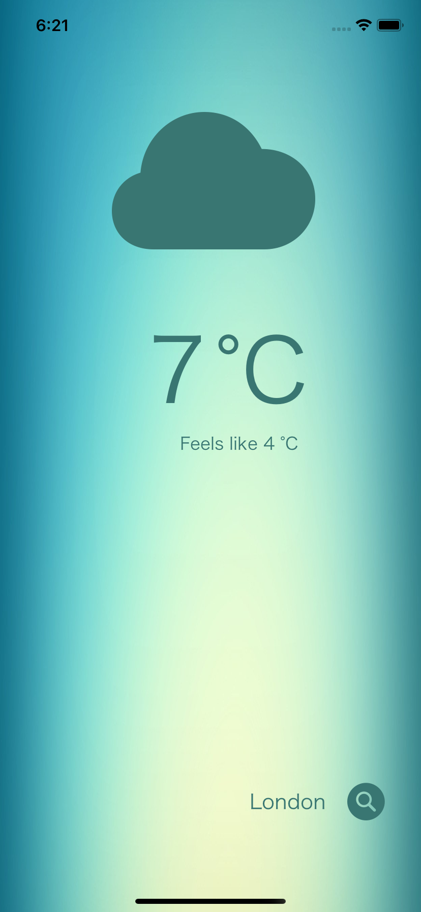
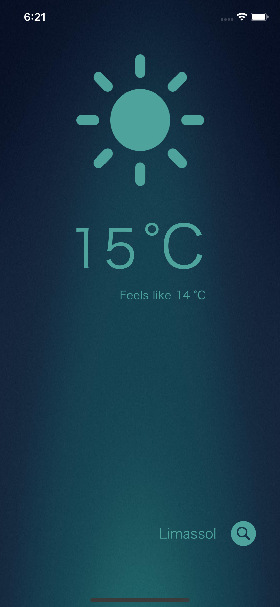

# WeatherApp

Учебное приложение для определения температуры и погоды в конкретном городе.

Было создано в рамках курса и для отработки следующих навыков:

- Работа с API (https://openweathermap.org/api).
- Определение геопозиции пользователя (CoreLocation).
- Использование AlertController
- Загрузка темной и светлой тем.
- Передача данных через clousers.
- Работа с git (github).

При первом запуске приложение запрашивает доступ к геопозиции пользователя, после чего обновляет UILabel’ы и UIImage в зависимости от полученного ответа. Также имеется возможность запросить погоду в городе по его названию.

    
    

## TODO:
- [ ] Расширить switch/case statement, отвечающий за распознование погодных кодов, для более релевантного отображения в UIImage.
- [ ] Добавить показатели максимальной и минимальной температур.
- [ ] Добавить показатели скорости ветра.